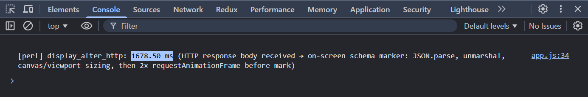
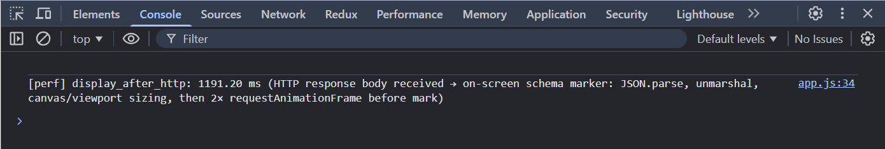
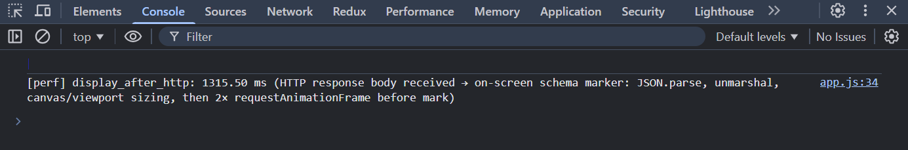
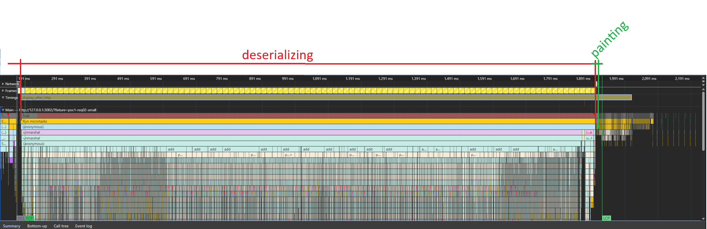
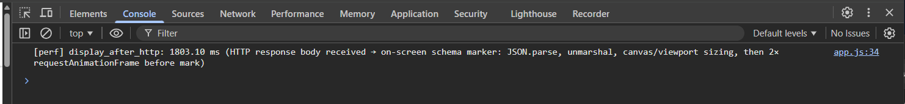
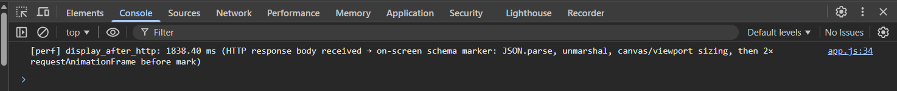
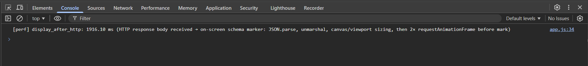
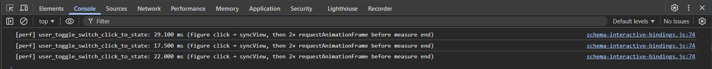
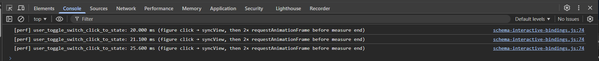

# Отчёт о тестировании производительности

Документ фиксирует результаты замеров согласно [требованиям](https://wiki.yandex.ru/mt/mt-rd/ict-next/ict-next-hld-high-level-design/product.epic-opisanie-plagins/ict-next.p.io-plagin-graficheskijj-redaktor-soedin/g2.poc-proverka-koncepta-2/https:/). Скриншоты: **`images/AC_1/`** (AC_01), **`images/AC_2/`** (AC_02).

## 1. Браузер и операционная система

| Параметр                                                | Значение                                                                                       |
| ----------------------------------------------------------------- | -------------------------------------------------------------------------------------------------------- |
| Браузер                                                  | **Google Chrome** 146.0.7680.165 (официальная сборка) (64 бит), канал: Stable |
| Версия (полная строка из`chrome://version`) | `4b989da09e15a7dc0de0785cb5ff232aadae3f0f-refs/branch-heads/7680@{#2932}`                              |
| ОС                                                            | **Windows 11** Version 24H2 (сборка 26100.6584)                                                  |
| JavaScript / V8                                                 | **V8** 14.6.202.26                                                                                     |

## 2. Аппаратная конфигурация ПК

| Компонент         | Значение                                          |
| ---------------------------- | ----------------------------------------------------------- |
| Производитель | LENOVO                                                    |
| Модель               | 21D9S2E900                                                |
| Процессор         | Intel(R) Core(TM) i7-12800H (12th Gen)                    |
| Ядра / потоки    | 14 физических / 20 логических         |
| ОЗУ                     | ~32 ГБ (34 009 374 720 байт)                     |
| Графика             | NVIDIA RTX A2000 Laptop GPU; Intel(R) Iris(R) Xe Graphics |

*Параметры сняты на машине прогона (WMI/CIM).*

## 3. Case AC_01. Результаты замеров (фикстуры [POC_1.REQ_01](https://wiki.yandex.ru/mt/mt-rd/ict-next/ict-next-hld-high-level-design/product.epic-opisanie-plagins/ict-next.p.io-plagin-graficheskijj-redaktor-soedin/g2.poc-proverka-koncepta-2/#/mt/mt-rd/scada-gen2/scada-gen2-obraz-i-granicy-reshenija/g2.poc-proverka-koncepta-2/poc1.req01/) и [POC_1.REQ_02](https://wiki.yandex.ru/mt/mt-rd/ict-next/ict-next-hld-high-level-design/product.epic-opisanie-plagins/ict-next.p.io-plagin-graficheskijj-redaktor-soedin/g2.poc-proverka-koncepta-2/#/mt/mt-rd/scada-gen2/scada-gen2-obraz-i-granicy-reshenija/g2.poc-proverka-koncepta-2/poc1.req02/))

### 3.1. Имя User Timing-метрики

Для обеих фикстур используется одна и та же measure **`display_after_http`** (см. `client/js/app.js`).

### 3.2. Границы интервала (начало → конец)

| Точка       | Что происходит в коде                                                                                                                                                                                                                                                                                                                                                                                                                        |
| ------------------ | ---------------------------------------------------------------------------------------------------------------------------------------------------------------------------------------------------------------------------------------------------------------------------------------------------------------------------------------------------------------------------------------------------------------------------------------------------------------- |
| **Начало** | Сразу после получения**тела HTTP-ответа** (`fetch` → `res.text()`): вызов `performance.mark('http_fetch_end')`. **Не включает** время сети до прихода ответа и не совпадает с «началом загрузки страницы» из формулировки AC_01 в PDF (навигация, парсинг HTML, исполнение скриптов до `fetch`). |
| **Конец**   | Сразу перед фиксацией видимости схемы: внутри колбэка**второго** вложенного `requestAnimationFrame` вызывается `markSchemaVisible()` → `performance.mark('schema_visible')`.                                                                                                                                                                                                         |

### 3.3. Какой «кадр» считается концом интервала

Цепочка такая: после `fitCanvasToViewportAndContent` планируется первый `requestAnimationFrame`, в его колбэке планируется второй, во **втором** колбэке выполняется `markSchemaVisible`.

- Конец измерения — **момент входа во второй колбэк `requestAnimationFrame`** (синхронный старт `markSchemaVisible`)
- Двойной `requestAnimationFrame` — распространённая эвристика: дать движку шанс выполнить стиль/лейаут и подготовить кадр после тяжёлой синхронной работы (разбор JSON, unmarshal, изменение размеров холста). Это **не гарантирует** завершение композитинга/отрисовки пикселей на экране; для строгого совпадения с формулировкой «полное отображение» в идеале дополняют визуальный контроль по требованиям (кейсы 1 и 2) или инструменты **Performance** / скриншоты.

### 3.4. Таблица прогонов — сравнение `display_after_http`

Значения сняты со строк консоли Chrome (**`[perf] display_after_http`**), источник лога — `app.js`.

| № | `poc1-req02-small`, мс | `poc1-req01-big`, мс |
| :--: | -------------------------: | -----------------------: |
| 1 |                  1678.50 |                1803.10 |
| 2 |                  1191.20 |                1838.40 |
| 3 |                  1315.50 |                1916.10 |

| № | Скриншот small                                | Скриншот big                                |
| :--: | ------------------------------------------------------- | ----------------------------------------------------- |
| 1 | [render_1](images/AC_1/poc1-req02-small_render_1.png) | [render_1](images/AC_1/poc1-req01-big_render_1.png) |
| 2 | [render_2](images/AC_1/poc1-req02-small_render_2.png) | [render_2](images/AC_1/poc1-req01-big_render_2.png) |
| 3 | [render_3](images/AC_1/poc1-req02-small_render_3.png) | [render_3](images/AC_1/poc1-req01-big_render_3.png) |

### 3.5. Агрегированные показатели — сравнение

| Показатель | `poc1-req02-small`, мс | `poc1-req01-big`, мс |
| ---------------------- | -------------------------: | -----------------------: |
| **Минимум**   |                  1191.20 |                1803.10 |
| **Максимум** |                  1678.50 |                1916.10 |
| **Среднее**   |              **1395.07** |            **1852.53** |

В среднем по трём прогонам **`poc1-req01-big`** дольше **`poc1-req02-small`** примерно на **+33%** по **`display_after_http`**.

---

## 4. Иллюстрации AC_01 (`images/AC_1/`)

### 4.1. `poc1-req02-small` — консоль

Пример записи **Performance** для наглядности (первичная загрузка малой фикстуры):

### 4.2. `poc1-req01-big` — консоль

---

## 5. Case AC_02. Результаты замеров (фикстуры `poc1-req02-small` и `poc1-req01-big`)

Зафиксировать задержку **от клика по выключателю** до конца интервала **syncView + два кадра** (`requestAnimationFrame`), по той же эвристике, что **`schema_visible`** в `client/js/app.js`. Критерий **AC_02** и пороги — по ICT_NEXT.P.IO.PERF (сверка с PDF). Те же фикстуры, что в **§3**.

**Воспроизведение:** открыть `?fixture=poc1-req02-small` или `?fixture=poc1-req01-big` → дождаться **`[perf] display_after_http`** → **три** последовательных клика по одному из привязанных выключателей (`installSchemaInteractiveBindings` в `schema-interactive-bindings.js`). Снять три строки **`[perf] user_toggle_switch_click_to_state`** (лог после **2× `requestAnimationFrame`**).

### 5.1. Имя User Timing-метрики

Для обеих фикстур используется одна и та же measure **`user_toggle_switch_click_to_state`** (см. `client/js/schema-interactive-bindings.js`). В консоли: *figure click → syncView, then 2× requestAnimationFrame before measure end*.

### 5.2. Границы интервала (начало → конец)

| Точка       | Что происходит в коде                                                                                                                                                                                                                                                                                                                                                                                                                                                                                                                                                                                                                                                        |
| ------------------ | ------------------------------------------------------------------------------------------------------------------------------------------------------------------------------------------------------------------------------------------------------------------------------------------------------------------------------------------------------------------------------------------------------------------------------------------------------------------------------------------------------------------------------------------------------------------------------------------------------------------------------------------------------------------------------------------------ |
| **Начало** | В обработчике`onToggleClick`: при необходимости `clearMarks`, затем `performance.mark('user_toggle_switch_input')`. Первый замер внутри колбэка клика по треку / ручке / подписи; **не включает** время доставки события в очередь до входа в обработчик. Инкрементируется **`toggleFrameSeq`** (на экземпляр выключателя), чтобы устаревшие колбэки `requestAnimationFrame` не ставили конечную метку после быстрого повторного клика. |
| **Конец**   | Во**втором** вложенном `requestAnimationFrame` после `syncView()` (с тем же `toggleFrameSeq`): `performance.mark('user_toggle_switch_state_ready')`, затем `performance.measure('user_toggle_switch_click_to_state', 'user_toggle_switch_input', 'user_toggle_switch_state_ready')` и вывод в консоль. Если клик перебил предыдущий замер, колбэк выходит без метки и без `measure`.                                                                                                                                                                                                     |

### 5.3. Какой момент считается концом интервала

Цепочка: **`mark('user_toggle_switch_input')` → `on = !on` → `syncView()`** (синхронное обновление фигур) → **`requestAnimationFrame` → `requestAnimationFrame` → `mark('user_toggle_switch_state_ready')`**.

- Конец измерения — **вход во второй вложенный колбэк `requestAnimationFrame`**, до него выполнен тот же рисунок, что для **`schema_visible`** в **§3.3**: дать движку шанс выполнить стиль / лейаут и подготовить кадр после изменения сцены.
- Это **не гарантирует** полное завершение композитинга до пикселей на экране; для жёсткой проверки реакции дополняют **Performance** (см. **§6.1**) и визуальный контроль.

### 5.4. Таблица прогонов — сравнение `user_toggle_switch_click_to_state`

Значения сняты со строк консоли Chrome (**`[perf] user_toggle_switch_click_to_state`**), источник лога — `schema-interactive-bindings.js` (после **2× `requestAnimationFrame`**).

| № | `poc1-req02-small`, мс | `poc1-req01-big`, мс |
| :--: | -------------------------: | -----------------------: |
| 1 |                   29.100 |                 20.000 |
| 2 |                   17.500 |                 21.100 |
| 3 |                   22.000 |                 25.600 |

| № | Скриншот small                                                 | Скриншот big                                               |
| :--: | ------------------------------------------------------------------------ | -------------------------------------------------------------------- |
| 1 | [poc1-req02-small_render.png](images/AC_2/poc1-req02-small_render.png) | [poc1-req01-big_render.png](images/AC_2/poc1-req01-big_render.png) |
| 2 | [poc1-req02-small_render.png](images/AC_2/poc1-req02-small_render.png) | [poc1-req01-big_render.png](images/AC_2/poc1-req01-big_render.png) |
| 3 | [poc1-req02-small_render.png](images/AC_2/poc1-req02-small_render.png) | [poc1-req01-big_render.png](images/AC_2/poc1-req01-big_render.png) |

*По одному консольному PNG на фикстуру; строки 1–3 повторяют ссылку (как в **§3.4**).*

### 5.5. Агрегированные показатели — сравнение

| Показатель | `poc1-req02-small`, мс | `poc1-req01-big`, мс |
| ---------------------- | -------------------------: | -----------------------: |
| **Минимум**   |                   17.500 |                 20.000 |
| **Максимум** |                   29.100 |                 25.600 |
| **Среднее**   |               **22.867** |             **22.233** |

---

## 6. Иллюстрации AC_02 (`images/AC_2/`)

### 6.1. `poc1-req02-small` — консоль

Пример записи **Performance** для наглядности (клик по выключателю, User Timing **`user_toggle_switch_click_to_state`** на таймлайне):

### 6.2. `poc1-req01-big` — консоль

