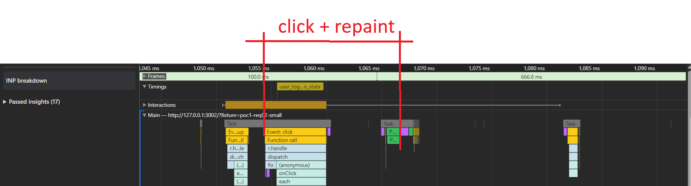
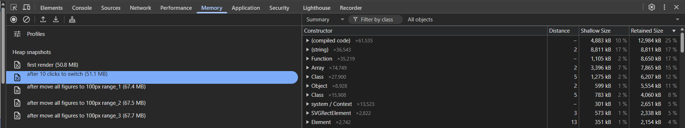
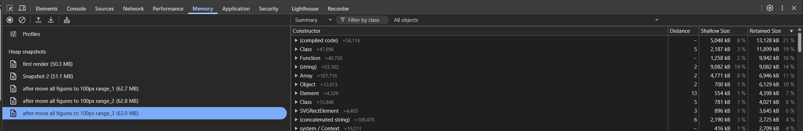
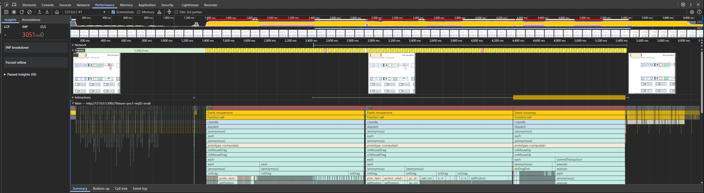
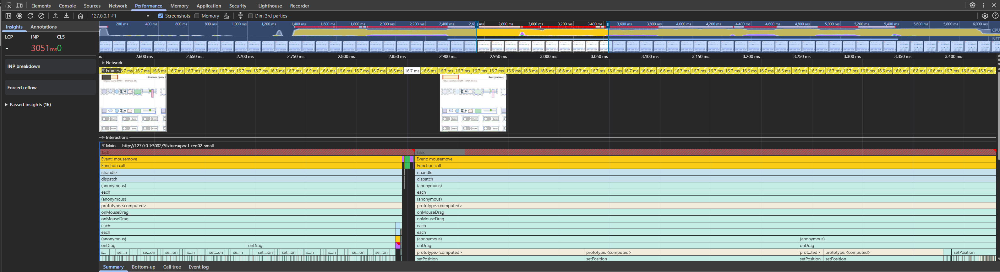
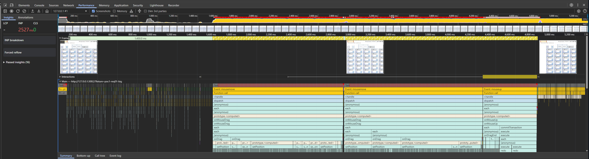
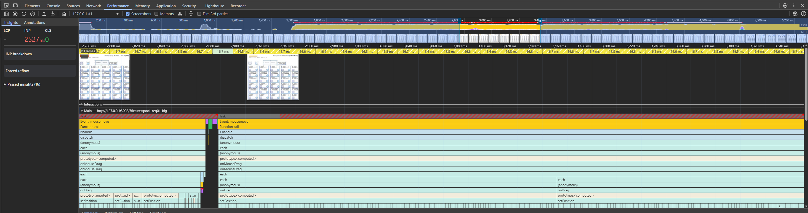

# Отчёт о тестировании производительности

Документ фиксирует результаты замеров согласно [требованиям](https://wiki.yandex.ru/mt/mt-rd/ict-next/ict-next-hld-high-level-design/product.epic-opisanie-plagins/ict-next.p.io-plagin-graficheskijj-redaktor-soedin/g2.poc-proverka-koncepta-2/?utm_referrer=about%3Ablank). Скриншоты: **`images/AC_1/`** (AC_01), **`images/AC_2/`** (AC_02), **`images/AC_3/`** (AC_03), **`images/AC_4/`** (AC_04).

## 1. Браузер и операционная система

| Параметр                                                | Значение                                                                                       |
| ----------------------------------------------------------------- | -------------------------------------------------------------------------------------------------------- |
| Браузер                                                  | **Google Chrome** 146.0.7680.165 (официальная сборка) (64 бит), канал: Stable |
| Версия (полная строка из`chrome://version`) | `4b989da09e15a7dc0de0785cb5ff232aadae3f0f-refs/branch-heads/7680@{#2932}`                              |
| ОС                                                            | **Windows 11** Version 24H2 (сборка 26100.6584)                                                  |
| JavaScript / V8                                                 | **V8** 14.6.202.26                                                                                     |

## 2. Аппаратная конфигурация ПК

| Компонент         | Значение                                          |
| ---------------------------- | ----------------------------------------------------------- |
| Производитель | LENOVO                                                    |
| Модель               | 21D9S2E900                                                |
| Процессор         | Intel(R) Core(TM) i7-12800H (12th Gen)                    |
| Ядра / потоки    | 14 физических / 20 логических         |
| ОЗУ                     | ~32 ГБ (34 009 374 720 байт)                     |
| Графика             | NVIDIA RTX A2000 Laptop GPU; Intel(R) Iris(R) Xe Graphics |

*Параметры сняты на машине прогона (WMI/CIM).*

## 3. Case AC_01. Результаты замеров (фикстуры [POC_1.REQ_01](https://wiki.yandex.ru/mt/mt-rd/ict-next/ict-next-hld-high-level-design/product.epic-opisanie-plagins/ict-next.p.io-plagin-graficheskijj-redaktor-soedin/g2.poc-proverka-koncepta-2/#/mt/mt-rd/scada-gen2/scada-gen2-obraz-i-granicy-reshenija/g2.poc-proverka-koncepta-2/poc1.req01/) и [POC_1.REQ_02](https://wiki.yandex.ru/mt/mt-rd/ict-next/ict-next-hld-high-level-design/product.epic-opisanie-plagins/ict-next.p.io-plagin-graficheskijj-redaktor-soedin/g2.poc-proverka-koncepta-2/#/mt/mt-rd/scada-gen2/scada-gen2-obraz-i-granicy-reshenija/g2.poc-proverka-koncepta-2/poc1.req02/))

### 3.1. Имя User Timing-метрики

Для обеих фикстур используется одна и та же measure **`display_after_http`** (см. `client/js/app.js`).

### 3.2. Границы интервала (начало → конец)

| Точка       | Что происходит в коде                                                                                                                                                                                                                                                                                                                                                                                                                        |
| ------------------ | ---------------------------------------------------------------------------------------------------------------------------------------------------------------------------------------------------------------------------------------------------------------------------------------------------------------------------------------------------------------------------------------------------------------------------------------------------------------- |
| **Начало** | Сразу после получения**тела HTTP-ответа** (`fetch` → `res.text()`): вызов `performance.mark('http_fetch_end')`. **Не включает** время сети до прихода ответа и не совпадает с «началом загрузки страницы» из формулировки AC_01 в PDF (навигация, парсинг HTML, исполнение скриптов до `fetch`). |
| **Конец**   | Сразу перед фиксацией видимости схемы: внутри колбэка**второго** вложенного `requestAnimationFrame` вызывается `markSchemaVisible()` → `performance.mark('schema_visible')`.                                                                                                                                                                                                         |

### 3.3. Какой «кадр» считается концом интервала

Цепочка такая: после `fitCanvasToViewportAndContent` планируется первый `requestAnimationFrame`, в его колбэке планируется второй, во **втором** колбэке выполняется `markSchemaVisible`.

- Конец измерения — **момент входа во второй колбэк `requestAnimationFrame`** (синхронный старт `markSchemaVisible`)

### 3.4. Таблица прогонов — сравнение `display_after_http`

Значения сняты со строк консоли Chrome (**`[perf] display_after_http`**), источник лога — `app.js`.

| № | `poc1-req02-small`, мс | `poc1-req01-big`, мс |
| :--: | -------------------------: | -----------------------: |
| 1 |                  1678.50 |                1803.10 |
| 2 |                  1191.20 |                1838.40 |
| 3 |                  1315.50 |                1916.10 |

### 3.5. Агрегированные показатели — сравнение

| Показатель | `poc1-req02-small`, мс | `poc1-req01-big`, мс |
| ---------------------- | -------------------------: | -----------------------: |
| **Минимум**   |                  1191.20 |                1803.10 |
| **Максимум** |                  1678.50 |                1916.10 |
| **Среднее**   |              **1395.07** |            **1852.53** |

---

## 4. Иллюстрации AC_01 (`images/AC_1/`)

### 4.1. `poc1-req02-small` — консоль

Пример записи **Performance** для наглядности (первичная загрузка малой фикстуры):

### 4.2. `poc1-req01-big` — консоль

---

## 5. Case AC_02. Результаты замеров (фикстуры `poc1-req02-small` и `poc1-req01-big`)

Зафиксировать задержку **от клика по выключателю** до конца интервала **syncView + два кадра** (`requestAnimationFrame`),аналогично **`schema_visible`** в `client/js/app.js`.

**Воспроизведение:** открыть `?fixture=poc1-req02-small` или `?fixture=poc1-req01-big`→ **три** последовательных клика по одному из привязанных выключателей (`installSchemaInteractiveBindings`в`schema-interactive-bindings.js`). Снять три строки **`[perf] user_toggle_switch_click_to_state`** (лог после **2× `requestAnimationFrame`**).

### 5.1. Имя User Timing-метрики

Для обеих фикстур используется одна и та же measure **`user_toggle_switch_click_to_state`** (см. `client/js/schema-interactive-bindings.js`). В консоли: *figure click → syncView, then 2× requestAnimationFrame before measure end*.

### 5.2. Границы интервала (начало → конец)

| Точка       | Что происходит в коде                                                                                                                                                                                                                                                                                                                                                                                                                                                                                                                                                                                                                                                        |
| ------------------ | ------------------------------------------------------------------------------------------------------------------------------------------------------------------------------------------------------------------------------------------------------------------------------------------------------------------------------------------------------------------------------------------------------------------------------------------------------------------------------------------------------------------------------------------------------------------------------------------------------------------------------------------------------------------------------------------------ |
| **Начало** | В обработчике`onToggleClick`: при необходимости `clearMarks`, затем `performance.mark('user_toggle_switch_input')`. Первый замер внутри колбэка клика по треку / ручке / подписи; **не включает** время доставки события в очередь до входа в обработчик. Инкрементируется **`toggleFrameSeq`** (на экземпляр выключателя), чтобы устаревшие колбэки `requestAnimationFrame` не ставили конечную метку после быстрого повторного клика. |
| **Конец**   | Во**втором** вложенном `requestAnimationFrame` после `syncView()` (с тем же `toggleFrameSeq`): `performance.mark('user_toggle_switch_state_ready')`, затем `performance.measure('user_toggle_switch_click_to_state', 'user_toggle_switch_input', 'user_toggle_switch_state_ready')` и вывод в консоль. Если клик перебил предыдущий замер, колбэк выходит без метки и без `measure`.                                                                                                                                                                                                     |

### 5.3. Какой момент считается концом интервала

Цепочка: **`mark('user_toggle_switch_input')` → `on = !on` → `syncView()`** (синхронное обновление фигур) → **`requestAnimationFrame` → `requestAnimationFrame` → `mark('user_toggle_switch_state_ready')`**.

- Конец измерения — **вход во второй вложенный колбэк `requestAnimationFrame`**, до него выполнен тот же рисунок, что для **`schema_visible`** в **§3.3**: дать движку шанс выполнить стиль / лейаут и подготовить кадр после изменения сцены.

### 5.4. Таблица прогонов — сравнение `user_toggle_switch_click_to_state`

Значения сняты со строк консоли Chrome (**`[perf] user_toggle_switch_click_to_state`**), источник лога — `schema-interactive-bindings.js` (после **2× `requestAnimationFrame`**).

| № | `poc1-req02-small`, мс | `poc1-req01-big`, мс |
| :--: | -------------------------: | -----------------------: |
| 1 |                   29.100 |                 20.000 |
| 2 |                   17.500 |                 21.100 |
| 3 |                   22.000 |                 25.600 |

### 5.5. Агрегированные показатели — сравнение

| Показатель | `poc1-req02-small`, мс | `poc1-req01-big`, мс |
| ---------------------- | -------------------------: | -----------------------: |
| **Минимум**   |                   17.500 |                 20.000 |
| **Максимум** |                   29.100 |                 25.600 |
| **Среднее**   |               **22.867** |             **22.233** |

---

## 6. Иллюстрации AC_02 (`images/AC_2/`)

### 6.1. `poc1-req02-small` — консоль

Пример записи **Performance** для наглядности (клик по выключателю, User Timing **`user_toggle_switch_click_to_state`** на таймлайне):

### 6.2. `poc1-req01-big` — консоль

---

## 7. Case AC_03. Память (Heap snapshots, `poc1-req02-small` и `poc1-req01-big`)

**Цель:** зафиксировать **рост объёма кучи** в Chrome после ключевых шагов сценария: первичная отрисовка схемы, **10 кликов** по интерактивному выключателю, **три** последовательных сдвига всего выделения на **~100 px** на холсте (ориентир — шкала в `client/js/perf-drag-distance-guide.js`, см. **AC_04** в требованиях и **§9**).

**Инструмент:** DevTools → **Memory** → **Heap snapshot**; для каждого этапа делается отдельный снимок с понятной подписью в списке слева. В таблице ниже используется **итоговый размер снимка**, как показано в списке снимков (колонка размера у записи).

### 7.1. Воспроизведение (общая схема)

1. Открыть `?fixture=poc1-req02-small` или `?fixture=poc1-req01-big`, дождаться готовности схемы (при необходимости — строка **`[perf] display_after_http`** в консоли).
2. **Снимок 1:** «first render» / первый рендер после загрузки.
3. Выполнить **10 кликов** по одному и тому же выключателю (как в **§5**). **Снимок 2:** после 10-го клика.
4. Выделить **все фигуры**, перетащить выделение на **~100 px** (три отдельных прогона перетаскивания). После **каждого** завершённого переноса сделать снимок: **«after move all figures to 100px range_1» … `_2` … `_3`**.
5. Порядок снимков и подписи должны совпадать с зафиксированными на скриншотах в **`images/AC_3/`**.

**После действия и перед съёмкой heap snapshot рекомендуется выдержать паузу 5–10 с, чтобы объём занятой памяти стабилизировался после кратковременного пика.*

### 7.2. Таблица этапов — сравнение размера heap snapshot (МБ)

| Этап                                                               | `poc1-req02-small`, МБ | `poc1-req01-big`, МБ |
| ------------------------------------------------------------------------ | -------------------------: | -----------------------: |
| Первый рендер (first render)                               |                     50.8 |                   50.3 |
| После**10** кликов по выключателю              |                     51.1 |                   51.1 |
| После сдвига всех фигур ~100 px,**прогон 1** |                     67.4 |                   62.7 |
| …**прогон 2**                                                   |                     67.5 |                   62.8 |
| …**прогон 3**                                                   |                     67.7 |                   63.0 |

### 7.4. Три прогона сдвига — сравнение стабильности размера снимка (МБ)

| Показатель                            | `poc1-req02-small` | `poc1-req01-big` |
| ------------------------------------------------- | -------------------: | -----------------: |
| **Минимум** (из прогонов 1–3) |               67.4 |             62.7 |
| **Максимум**                            |               67.7 |             63.0 |
| **Среднее**                              |          **67.53** |        **62.83** |

---

## 8. Иллюстрации AC_03 (`images/AC_3/`)

### 8.1. `poc1-req02-small` — Memory, список heap snapshots

### 8.2. `poc1-req01-big` — Memory, список heap snapshots

---

## 9. Case AC_04. Кадры при переносе (`poc1-req02-small` и `poc1-req01-big`, визуальный разбор Performance)

Открыть проект → **выделить все элементы** → **перенести на 100 px** → проконтролировать **частоту кадров** в DevTools.

Ниже — разбор записей **Performance** для **обеих** фикстур: дорожка **Frames** (длительность кадра, жёлтые кадры), **INP** в Insights и **Main** (длинные **`mousemove`** / **`onMouseDrag`**).

**Воспроизведение:**

1. **`?fixture=poc1-req02-small`** или **`?fixture=poc1-req01-big`** → дождаться готовности схемы.
2. **Выделить все фигуры** → перетащить выделение примерно на **100 px** (ориентир — шкала в `client/js/perf-drag-distance-guide.js`, см. **§7**).
3. Записать профиль в **DevTools → Performance** → остановить запись после завершения жеста.

### 9.1. Инструмент и что смотреть

| Элемент интерфейса | Что фиксируем для отчёта                                                                                                                                                                                                                                                                                                                                                                                                                                      |
| ------------------------------------- | ------------------------------------------------------------------------------------------------------------------------------------------------------------------------------------------------------------------------------------------------------------------------------------------------------------------------------------------------------------------------------------------------------------------------------------------------------------------------------------ |
| **Insights → INP**                 | Задержка от взаимодействия до следующего отображения.**Зелёная** зона — отзывчивость приемлема; **красная** — пользователь долго ждёт обновления экрана при том же жесте.                                                                                                                                                                |
| **Дорожка Frames**           | У каждого кадра подписана**длительность** (мс). Для **60 Hz** ориентир одного кадра **~16.7 ms**; для **30 FPS** — **~33.3 ms**. **Зелёный** кадр — укладывается в бюджет; **жёлтый** — кадр с проблемами. На скриншотах в **`images/AC_4/`** проблемные кадры **жёлтые**, без красной полоски сверху. |
| **Дорожка Interactions**     | Длина полосы взаимодействия (перетаскивание) и её цвет в Insights.                                                                                                                                                                                                                                                                                                                                                                  |
| **Дорожка Main**             | Длинные блоки **Task**, **Event: mousemove** / **mouseup** во время drag; стек **`onMouseDrag`**, **`setPosition`**.                                                                                                                                                                                                                                                                                                                                        |

### 9.2. Как смысл переводится в **Frame Time Delta** и **Dropped Frames**

- **Frame Time Delta** — насколько **ровно** идут обновления: ряд **~16.7 ms** (или **~33.3 ms** под цель 30 FPS) vs **длинные разрывы** из‑за задач на Main и высокий **INP**.
- **Dropped Frames** в бытовом смысле: при **жёлтых** кадрах подряд и **высоком INP** картинка **не успевает** за вводом;

### 9.3. Наблюдения по скриншотам **`images/AC_4/`**

Сценарий для **обеих** фикстур: **выделить всё → перенос ~100 px**. По два файла на фикстуру: **обзор** (`*_frames_1.png`) и **фрагмент таймлайна** (`*_frames_2.png`).

#### 9.3.1. `poc1-req02-small`

| Вопрос | Что видно на скриншотах                                                                                                                                                                                                                                                                                                                                                                                                                                                                                           |
| -------------- | --------------------------------------------------------------------------------------------------------------------------------------------------------------------------------------------------------------------------------------------------------------------------------------------------------------------------------------------------------------------------------------------------------------------------------------------------------------------------------------------------------------------------------------- |
| **INP**      | Порядка**~3050 ms**, **красная** зона Insights — отклик при перетаскивании всего выделения **очень медленный**.                                                                                                                                                                                                                                                                                                                                                 |
| **Frames**   | На отрезке активного переноса (порядка**~1.4–5.4 s** на **`poc1-req02-small_frames_1.png`**) преобладают **жёлтые** кадры; на **`poc1-req02-small_frames_2.png`** видны подписи длительности кадров и **очень длинные** **Task** на **Main** после **`Event: mousemove`** (сотни ms) — обновление сцены **не укладывается** в сценарий «стабильные **60 FPS**». |
| **Main**     | Цепочка **`mousemove`** → **`onMouseDrag`** / **`onDrag`**, много **`setPosition`** по всем фигурам выделения — блокировка main thread на время обработки ввода.                                                                                                                                                                                                                                                                                                   |

#### 9.3.2. `poc1-req01-big` (кейс 6, ориентир PDF **30 FPS**)

| Вопрос | Что видно на скриншотах                                                                                                                                                                                                                                                                                                                                                                                                                                                                                                                         |
| -------------- | --------------------------------------------------------------------------------------------------------------------------------------------------------------------------------------------------------------------------------------------------------------------------------------------------------------------------------------------------------------------------------------------------------------------------------------------------------------------------------------------------------------------------------------------------------------------- |
| **INP**      | Порядка**~2530 ms**, **красная** зона — снова **секундная** задержка до следующего paint при том же сценарии на **большой** схеме.                                                                                                                                                                                                                                                                                                                                               |
| **Frames**   | Нам**`poc1-req01-big_frames_1.png`** после начала переноса (порядка **~1.6–4.8 s** на `poc1-req01-big_frames_1.png`) дорожка **Frames** — сплошные **жёлтые** кадры; подписи длительности часто **~16.5–16.7 ms** при жёлтом цвете. На **`poc1-req01-big_frames_2.png`** — детализация: крупные **`Event: mousemove`**, плотный стек вызовов при drag, завершение с **`mouseup`** / **`commitTransaction`**. |
| **Main**     | Те же узкие места: синхронная обработка**каждого** движения мыши по **всему** объёму большой схемы — **long tasks**, красная полоса long tasks в обзоре **Main**                                                                                                                                                                                                                                                                                                  |

### 9.4. Выводы по критериям

- **`poc1-req02-small`:** по визуальным данным при переносе **всего выделения** на **~100 px** нет устойчивой картины **INP ~3 s**, на **Frames** при drag доминируют **жёлтые** кадры, на **Main** — длинные задачи на **`mousemove`**.
- **`poc1-req01-big` :**  **INP ~2.5 s** и **сплошные жёлтые** кадры с **long tasks** на переносе всего выделения по-прежнему показывают **сильную потерю отзывчивости**;

---

## 10. Иллюстрации AC_04 (`images/AC_4/`)

### 10.1. `poc1-req02-small` — обзор записи Performance (перенос всего выделения ~100 px)

### 10.2. `poc1-req02-small` — фрагмент таймлайна (длительности кадров и длинные Task на Main)

### 10.3. `poc1-req01-big` — обзор записи Performance (перенос всего выделения ~100 px)

### 10.4. `poc1-req01-big` — фрагмент таймлайна (mousemove, onMouseDrag, mouseup)

---
